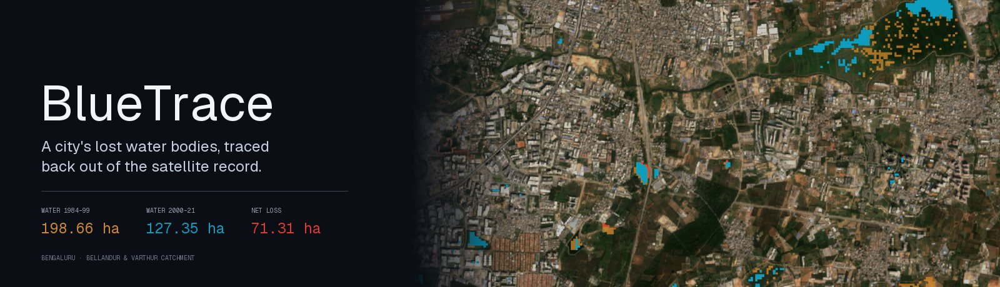
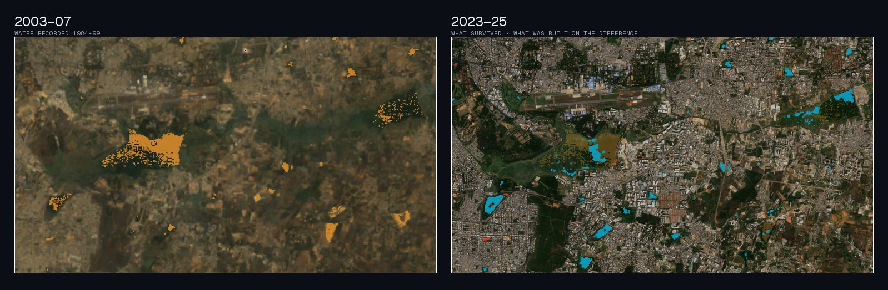
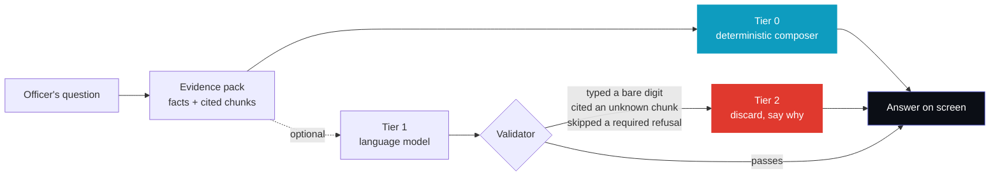
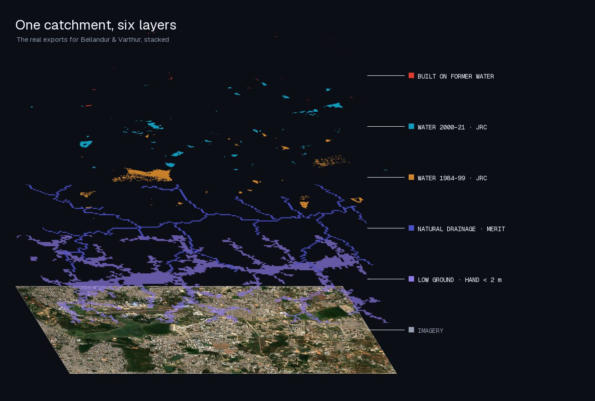
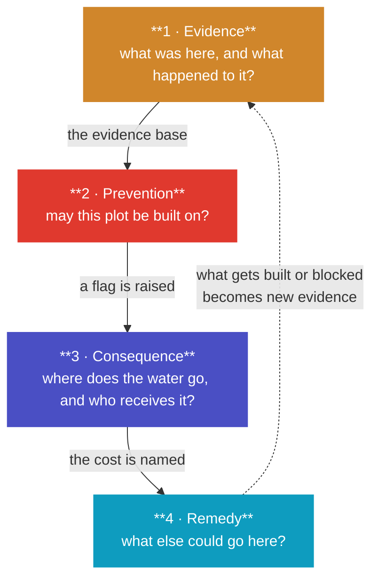
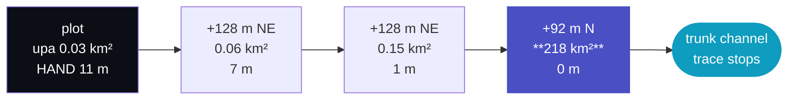
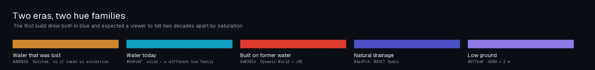
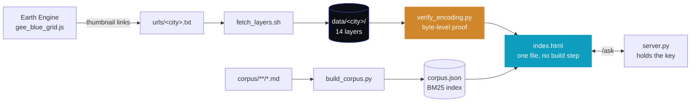

<p align="center">
  
  
  
  
  
</p>

**Reconstructs a city's lost water bodies from the satellite record, then flags
the buildings sitting on them, traces where their runoff goes, and states what
the land could hold instead.**

Not a flood predictor. An evidence tool: it says which structures are on former
water, ranks them by how much catchment they block, checks any plot before it
gets built on, and answers questions about that plot from a corpus where every
number carries the source it came from.

> ### ▶ Live
> **[Interactive explainer](https://redrangerwentwild.github.io/Plaksha_Prayas/)** — the layers below, rotatable in 3D, with an era slider.
> **[The screening tool itself](https://redrangerwentwild.github.io/Plaksha_Prayas/blue-grid/)** — the real map, timeline, plot check, routing and certificate. Runs entirely in the browser; answers are composed locally because a static host has no model endpoint.

---

## The problem

Bengaluru was built on a cascade of man-made tanks. Rain fell on high ground,
filled the first tank, overflowed down a channel into the next, and so on down
the valley. The tanks were the storage, the channels were the plumbing, and
together they were a drainage system that needed no pumps.

Over four decades tanks were drained and built over, and channels were
culverted, narrowed or filled. **The water still arrives. The storage no longer
does.**



Amber is water the satellites recorded in 1984–99. Cyan is what survived into
2000–21. The difference is 71.31 hectares — **35.9% of the blue grid** — and
this is one catchment.

When a neighbourhood floods, the cause is often a decision taken a decade
earlier, several kilometres uphill, by someone who never saw the consequence.
By the time the water is in somebody's ground floor, the evidence that a lake
was ever there has been paved over.

The record is not gone, though. *It is in orbit.*

---

## The approach

The tempting build is a flood predictor. It is also the one that falls apart
under questioning, because predicting flooding needs the drain network, a fine
elevation model, a local rainfall curve and a hydraulic solver — none of which
are derivable from satellite imagery.

So this is an evidence tool. It says what was there, what is there now, what was
built on the difference, where the displaced water goes, and what the site could
hold instead. **It declines the rest explicitly, in the answer itself.**

That discipline is enforced rather than promised:



A language model writes one paragraph of each answer and is **never allowed to
type a digit** — it emits `{{fact.distPresent}}` placeholders and the client
substitutes the measured value. Any bare numeral left in the prose is a
validation failure and the answer is discarded. A figure cannot appear without
a source attached, because there is nowhere else in the system for it to have
come from.

Tier 0 renders *first, always*, before any network call. Pull the cable and the
page behaves identically, minus one paragraph.

### What it refuses

| Asked for | Why it is declined |
|---|---|
| Flood depth, level, extent, probability | Needs the drain network, a fine DEM, a rainfall curve and a solver. Naming the four is more useful than inventing a number. |
| Damage cost | Needs asset values, occupancy and a depth–damage relationship. The volume and the exposure class are the inputs to hand someone who has those. |
| Legality | Turns on the notified boundary and the sanction record and its date. This reports measurements against a buffer figure it was told to apply. |
| The identity of an owner | The building layer is machine-derived geometry carrying no name, khata or survey number. |
| Anything outside the mapped rectangle | Including the runoff arithmetic. A volume computed from assumptions alone looks exactly like a measurement and is not one. |

> **None of the four screening outcomes is *approve*.** The tool screens; it does
> not grant permission. A rejection is a recommendation to refuse at screening
> stage, addressed to the sanctioning authority — not a decision taken on its behalf.

---

## Four layers



Evidence, prevention, consequence, remedy. They form a loop rather than a
sequence: each one removes an excuse for overriding the one before it.



### 1 · Evidence — *what was here, and what happened to it?*

Both eras of water come from **one** source: the JRC transition band, which
compares 1984–99 against 2000–21 across the whole Landsat archive with a single
method. Hand-differencing Landsat against Sentinel-2 cannot be made symmetric —
the finer sensor finds more water whatever is on the ground, and that gap shows
up as water appearing.

Scrub the timeline and the lost water fades from a hatched wash to a ghost while
its 1984–99 shoreline is drawn as a line over today's ground, with crimson
construction standing inside it.

`57.72 ha mapped loss` · `3.05 ha built on former water` · `shoreline traced in-browser`

### 2 · Prevention — *may this plot be built on?*

Click any plot for a screening decision against a selectable buffer regime. The
check reads the same rasters the map draws, pixel by pixel, in an offscreen
canvas — **no server, no API, no network. It cannot fail on stage.**

The finding worth demonstrating is the *shoreline disagreement*. An applicant
measures their buffer from the water's edge as it stands today. Where the lake
has already shrunk, that edge is something an encroachment produced — so the
buffer measured from the 1984–99 edge lands somewhere else entirely.

| Outcome | Meaning |
|---|---|
| 🔴 **REJECT** | Inside live water, on a former bed already carrying construction, or confidently inside a buffer. |
| 🟣 **REFER** | The measurement cannot resolve the question at ±20 m, or the two shorelines disagree. |
| 🟠 **CONDITIONS** | Low ground: retention and a plinth condition. |
| 🔵 **NO OBJECTION** | Nothing found — which at 30 m is not the same as nothing there. |

### 3 · Consequence — *where does the water go, and who receives it?*

Sealing a plot sends a computable volume of extra runoff downhill. Until this
layer the tool could state that volume and name nowhere it went, which left
*who pays* a rhetorical question.

It now walks MERIT Hydro's own flow-direction field downhill from the checked
plot, one 90 m cell at a time, and draws the line. **It reports *receiving*,
never inundation:** the route says water runs downhill across this ground, not
that the ground floods.



Height above drainage falls 11 → 7 → 1 → 0: the route runs monotonically
downhill. Upstream area climbs 0.03 → 218 km². **That last jump is the finding**
— three orders of magnitude in one step is the runoff joining Varthur's outflow,
350 m from the plot's edge.

### 4 · Remedy — *what else could go here?*

A tool that only blocks gets overridden. This one converts the displacement into
a retention requirement in cubic metres — hold back what sealing the plot added
and the catchment below is no worse off — and lists the land uses that can
discharge it.

| Use | Fires when |
|---|---|
| Restoration with the development value moved elsewhere | on the 1984–99 bed |
| A sunken park that holds the storm and looks like an amenity | low ground or at drainage level |
| Build around the channel rather than over it | on or beside a flow path |
| Return the water to the aquifer instead of to the drain | any site with a requirement |

It states a requirement and lists options. **It never recommends** — which one
applies is the authority's decision. And the panel does not appear at all unless
something *site-specific* fired: an option available on any plot is a
supplement, never a finding.

---

## Two eras, two hue families



The first build drew 1984–99 water in `#1f6feb` and 2000–21 water in `#58a6ff`,
over satellite imagery, and expected a viewer to tell two decades apart by
saturation. Nobody could — including the people who built it.

Water that survived is now cyan. Water that was lost is amber: a different hue
*family*, not a different shade of the same one. Amber alone is not enough
either, because dry-season Landsat over Bengaluru is very nearly the colour of
amber — so lost water is **hatched**, which reads as annotation in every mapping
tradition there is, and carries its 1984–99 shoreline as a drawn line.

> **The chrome is monochrome.** Graphite, paper, hairlines. Every colour on
> screen belongs to a data layer or to a verdict — a screening tool that paints
> its own buttons blue is telling the reader that blue means *clickable* at the
> same moment the map is telling them blue means *water*.

---

## How it is built



### Measurements travel as bytes, not as colour

Four of the exported PNGs are **never drawn**. They carry real quantities packed
into the RGB channels, and the client reads them back pixel by pixel in an
offscreen canvas. A distance field that `visualize()` quietly stretched would
make every reported distance wrong and entirely plausible — so the encoding is
checked rather than assumed.

| Layer | R | G | B |
|---|---|---|---|
| `buffers` | metres to today's water edge | metres to the 1984–99 edge | metres to nearest drainage |
| `history` | last year water was recorded | JRC occurrence, percent | height above nearest drainage |
| `hydro` | upstream area, **log-packed** | metres to a trunk channel | height above the AOI low point |
| `routing` | D8 flow direction, remapped 0–10 | *reserved* | *reserved* |

> **The direction channel is categorical, and that changes what can be checked.**
> The rule that catches a collapsed distance field — more than thirty distinct
> codes or it is a mask — would fail a perfectly good direction layer, which
> legally holds eleven. Worse, passing it would prove nothing: a flow field can
> be entirely plausible and entirely wrong. So the test is physics instead.
> **Upstream area must be non-decreasing downstream.** A transposed, flipped or
> averaged field breaks that immediately while still producing routes that look
> like routes.

### Answers are retrieved, not recalled

84 short chunks under `corpus/`, one idea each, every one carrying its source.
Chunks declare numeric *triggers* over the site record — `distHistoric == 0`,
`ruleId == ngt` — and those triggers are the dominant retrieval signal, with
wording similarity scored by BM25 as the rest.

| Kind | Chunks | What it holds |
|---|--:|---|
| `method` | 18 | how each measurement is made |
| `hydro` | 15 | runoff, exposure, retention |
| `rule` | 11 | buffer regimes and what governs |
| `refusal` | 8 | what the tool will not answer |
| `precedent` | 8 | independently recorded encroachment |
| `outcome` | 6 | what each verdict means |
| `limit` | 6 | where the method is weak |
| `error` | 5 | the uncertainty budget |
| `option` | 4 | what a flagged site could be instead |
| `scope` | 3 | what this tool is |

Design rainfall, runoff coefficients, buffer distances and the ±20 m error
budget are all declared on the chunk that cites their source, and
`check_corpus.py` fails if the code and the corpus ever disagree.

---

## What is actually claimed

There is no surveyed encroachment dataset for this catchment, so there is no
ground truth to score against and **no honest model-accuracy number to report.**
What can be measured is whether the references this pipeline depends on are
reproducible by an independent method.

| Test | Method | Result |
|---|---|---|
| Water reconstruction | Landsat 5 MNDWI against JRC's own per-year classification, same pixels, same years, on held-out spatial blocks | pooled IoU `0.43–0.81`<br>per-block median `0.21–0.69` |
| Flow-direction field | Upstream area along 400 traced routes must be non-decreasing downstream | `0` loops in 400<br>`0.0%` of 37,977 steps |
| Route agreement | Traced cells landing on the independently built flow-path mask, per block, three draws | `0.735–0.764`<br>baseline `0.053` |

> **Quote the range, not a run.** With 8 blocks held out of 24, which 8 they are
> moves the result more than the choice of threshold does. The pooled figure is
> also the flattering one: a single large lake carries it, and the blocks that
> score worst are the ones with almost no water in them, where the metric
> punishes a handful of misclassified pixels hardest.

### Known limits, stated up front

- **JRC surface water is 30 m** — tanks under roughly half a hectare are invisible.
- **MERIT Hydro is 90 m** — it resolves catchment drainage, not individual rajakaluves, which is why a drainage finding is always a referral and never a rejection.
- **Dynamic World's built class is conservative under tree canopy** — so the built-on-water hectare figure understates.
- **Hyacinth-covered lakes read as vegetation** in every water index, so Bellandur and Varthur are deliberately treated as surviving water rather than reported as destroyed.

**Every flag is a lead for ground verification, not a finding of fact.** That is
not a disclaimer bolted on at the end; it is why the tool issues a signed,
printable certificate carrying every measurement and its uncertainty, rather
than a score.

---

## Repository

```
README.md                   this page
docs/index.html             the interactive explainer (GitHub Pages)
blue-grid/
  gee_blue_grid.js          extraction — the only thing that touches Earth Engine
  index.html                the whole app: map, screening, routing, retention, certificate
  server.py                 serves the app, holds the API key, proxies one endpoint
  check_corpus.py           eleven checks; refuses to pass if code and corpus disagree
  verify_encoding.py        proves the byte-packed layers decoded losslessly
  validate.py               blockwise held-out scoring, and --routing agreement
  build_corpus.py           compiles corpus/**/*.md into a BM25 index
  corpus/                   84 chunks, one idea per file, each carrying its source
  data/<city>/              layers, stats, and the ranked building export
  assets/fonts/             self-hosted, so a demo that loses the network keeps its type
```

Roughly 7,300 lines. No framework, no bundler, no build step — the app is one
HTML file you can open and read top to bottom.

## Running it

```bash
cd blue-grid
python3 server.py                                              # answers stay local
BLUETRACE_PROVIDER=groq GROQ_API_KEY=... python3 server.py      # answers get a model
```

`file://` will not work — the browser blocks local image sources over CORS.
Without an API key the tool is fully functional; it simply composes each answer
itself and says so.

### Deploying

There are two deployments and the difference between them is one endpoint.

| | Serves | Answers |
|---|---|---|
| **GitHub Pages** | the app as static files | composed locally, always |
| **Render** | the same app, plus `/ask` | a model writes one paragraph, validated against the pack |

Everything measured — the plot check, the route, the retention figure, the
certificate — is computed in the browser and is identical on both. `render.yaml`
is a blueprint: point Render at this repository and it builds nothing, because
`server.py` imports only the standard library. Set `GROQ_API_KEY` in the
dashboard; it is deliberately `sync: false` so no key is ever committed.

On the free plan the service sleeps when idle and takes roughly a minute to
wake. That is survivable here precisely because a slow or absent `/ask` is not
a failure state: Tier 0 has already rendered.

**[Operating manual →](blue-grid/README.md)** — extraction, layer encodings, the
corpus format, the validation method, and where the method is weak.

---

<sub>Sources: JRC Global Surface Water v1.4 (1984–2021) · MERIT Hydro v1.0.1 ·
Google Dynamic World V1 · Google Open Buildings v3 · Landsat 5 C02 T1_L2 ·
Sentinel-2 SR Harmonized · Esri World Imagery. Every figure above is measured
from the exports in this repository. Buffer distances are operator
configuration, not a legal determination by this tool.</sub>
