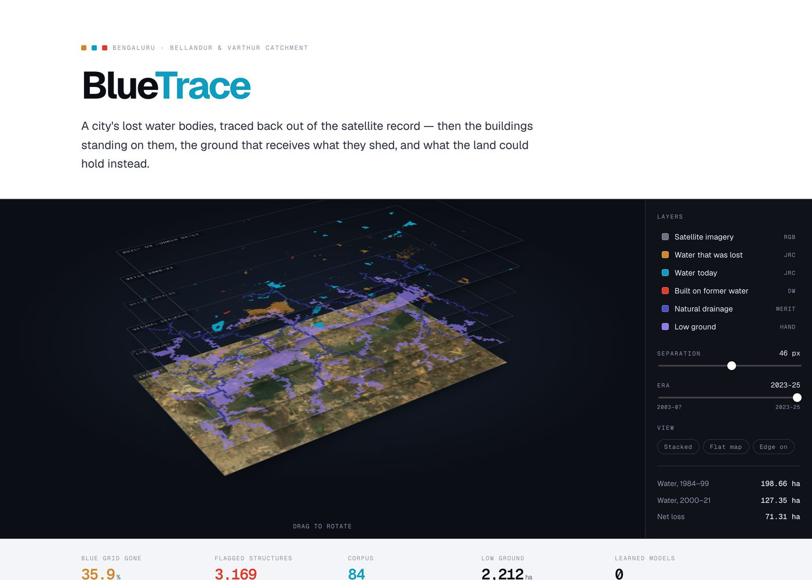

# BlueTrace

**Reconstructs a city's lost water bodies from the satellite record, then flags
the buildings sitting on them, traces where their runoff goes, and states what
the land could hold instead.**

Not a flood predictor. An evidence tool: it says which structures are on former
water, ranks them by how much catchment they block, checks any plot before it
gets built on, and answers questions about that plot from a corpus where every
number carries the source it came from.

---

### ▶ [Open the interactive explainer](https://redrangerwentwild.github.io/Plaksha_Prayas/)

[](https://redrangerwentwild.github.io/Plaksha_Prayas/)

The seven real exported layers for this catchment, stacked in 3D and rotatable.
Drag to turn the stack, toggle any layer on or off, pull the planes apart, and
scrub the era slider from 2003–07 to 2023–25 to watch the amber lost water fade
to a ghost while cyan survivors and crimson construction rise in its place. No
install, no account.

---

| Bengaluru &middot; Bellandur &amp; Varthur catchment | |
|---|---|
| Water, 1984–99 | **198.66 ha** |
| Water, 2000–21 | **127.35 ha** |
| Net loss | **71.31 ha** — 35.9% of the blue grid |
| Built on former water | 3.05 ha |
| Flood-prone low ground | 2,212 ha, carrying 13,818 buildings |
| Flagged structures | 3,169, ranked by downstream harm |

---

## The problem

Bengaluru was built on a cascade of man-made tanks. Rain fell on high ground,
filled the first tank, overflowed down a channel into the next, and so on down
the valley. The tanks were the storage and the channels were the plumbing, and
together they were a drainage system that needed no pumps.

Over four decades tanks were drained and built over, and channels were
culverted, narrowed or filled. The water still arrives. The storage no longer
does. When a neighbourhood floods, the cause is frequently a decision taken a
decade earlier, several kilometres uphill, by someone who never saw the
consequence — and by the time the water is in somebody's ground floor, the
evidence that a lake was ever there has been paved over.

The record is not gone, though. It is in orbit. Landsat has imaged this
catchment since 1984 and that archive has already been processed into a
per-pixel history of surface water. The question this project asks is whether
that record can be turned into something an officer can act on at the desk
where the damage is actually authorised.

---

## The approach

The tempting build is a flood predictor. It is also the one that falls apart
under questioning, because predicting flooding needs the drain network, a fine
elevation model, a local rainfall curve and a hydraulic solver — and none of
those are derivable from satellite imagery.

So this is an evidence tool. It says what was there, what is there now, what was
built on the difference, where the displaced water goes, and what the site could
hold instead. It declines the rest explicitly, in the answer itself.

That discipline is enforced rather than promised. A language model writes one
paragraph of each answer and is never allowed to type a digit: it emits
`{{fact.distPresent}}` placeholders and the client substitutes the measured
value. Any bare numeral left in the prose is a validation failure and the answer
is discarded. A figure therefore cannot appear in an answer without a source
attached, because there is nowhere else in the system for it to have come from.

---

## Four layers

Evidence, prevention, consequence, remedy. They form a loop rather than a
sequence: each one removes an excuse for overriding the one before it.

| | Question it answers | What it produces |
|---|---|---|
| **1 · Evidence** | What was here, and what happened to it? | Both eras of water from one JRC source, the 1984–99 shoreline traced as a line, and the construction standing inside it |
| **2 · Prevention** | May this plot be built on? | A screening decision against a selectable buffer regime, read pixel by pixel in the browser — no server, no network |
| **3 · Consequence** | Where does the water go, and who receives it? | A route walked down MERIT's flow-direction field to the ground that receives what the plot sheds |
| **4 · Remedy** | What else could go here? | A retention requirement in cubic metres, and the land uses that can discharge it |

Layer 1 builds the evidence base. Layer 2 uses it to prevent new damage. Layer 3
quantifies the consequence of overriding Layer 2. Layer 4 removes the political
excuse for overriding it — because an obstruction with no alternative gets
overridden, and *"you cannot build an apartment here, but here is what you can
build that is productive and fixes the drainage"* is a proposal a commissioner
can act on.

None of the four screening outcomes is **approve**. The tool screens; it does
not grant permission. A rejection is a recommendation to refuse at screening
stage, addressed to the sanctioning authority — not a decision taken on its
behalf.

### What it refuses, and why

| Asked for | Why it is declined |
|---|---|
| Flood depth, level, extent, probability | Needs the drain network, a fine DEM, a rainfall curve and a solver. Naming the four is more useful than inventing a number. |
| Damage cost | Needs asset values, occupancy and a depth–damage relationship. The volume and the exposure class are the inputs to hand someone who has those. |
| Legality | Turns on the notified boundary and the sanction record and its date. This reports measurements against a buffer figure it was told to apply. |
| The identity of an owner | The building layer is machine-derived geometry carrying no name, khata or survey number. |
| Anything outside the mapped rectangle | Including the runoff arithmetic. A volume computed from assumptions alone looks exactly like a measurement and is not one. |

Every flag is a lead for ground verification, not a finding of fact. That is why
the tool issues a signed, printable certificate carrying every measurement and
its uncertainty, rather than a score.

---

---

## Repository

```
blue-grid/                  the tool
  gee_blue_grid.js          extraction — the only thing that touches Earth Engine
  index.html                the whole app: map, screening, routing, retention, certificate
  server.py                 serves the app, holds the API key, proxies one endpoint
  check_corpus.py           eleven checks; refuses to pass if code and corpus disagree
  verify_encoding.py        proves the byte-packed layers decoded losslessly
  validate.py               blockwise held-out scoring, and --routing agreement
  build_corpus.py           compiles corpus/**/*.md into a BM25 index
  corpus/                   84 chunks, one idea per file, each carrying its source
  data/<city>/              layers, stats, and the ranked building export
  assets/fonts/             self-hosted, so a demo that loses the network keeps its type
```

Roughly 7,300 lines. No framework, no bundler, no build step — the app is one
HTML file you can open and read top to bottom.

## Running it

```
cd blue-grid
python3 server.py                                  # answers stay local
BLUETRACE_PROVIDER=groq GROQ_API_KEY=... python3 server.py   # answers get a model
```

`file://` will not work — the browser blocks local image sources over CORS.
Without an API key the tool is fully functional; it simply composes each answer
itself and says so.

**[Operating manual →](blue-grid/README.md)** — extraction, layer encodings, the
corpus format, the validation method, and where the method is weak.

## Sources

JRC Global Surface Water v1.4 (1984–2021) · MERIT Hydro v1.0.1 · Google Dynamic
World V1 · Google Open Buildings v3 · Landsat 5 C02 T1_L2 · Sentinel-2 SR
Harmonized · Esri World Imagery.

Buffer distances are operator configuration, not a legal determination by this
tool. Every flag is a lead for ground verification, not a finding of fact.
